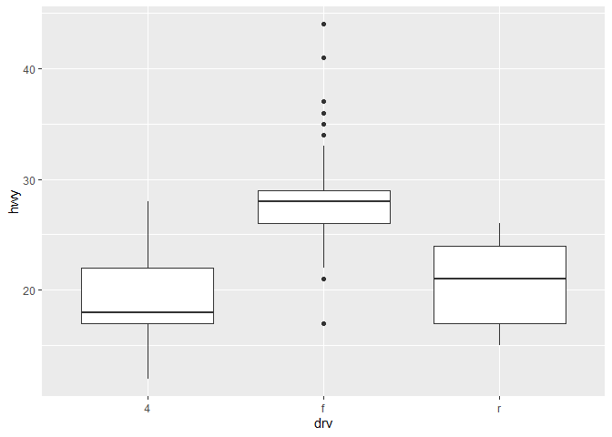
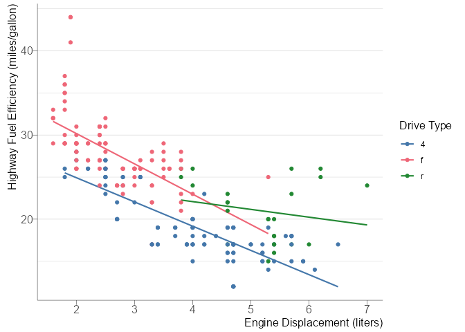

R and GitHub
================

<style>
  code{
  font-family: Inconsolata, Consolas, monospace;
}
  body{
  font-family: Calibri, Arial, sans-serif;
}
  blockquote{
  font-size: 14px
}
</style>

# Why/How to Use R

## Reproducibility, Sourcing

With R, you can create a script tracing all of the actions done with
data. With an excel sheet, it can be difficult or impossible to trace
how data was manipulated from its source. If you can read an R script,
you can see how and why certain choices were made. It can make finding
and fixing mistakes simpler (the pain I’ve felt debugging complex Excel
formulas 😶‍🌫️)

## Getting into R with the Tidyverse

If you tried getting into R years ago you may have missed out on the
`tidyverse`, which is a series of packages which share a common
philosophy and evaluation techniques. It has really taken off in
popularity in the last decade or so. Personally, I have found this way
of writing R to improve my ability to read and write understandable
code.

A couple of common features of R with `tidyverse` packages: - *“Tidy”
data*: Datasets are assumed to be tidy, which is a way of structuring
data such that each row represents one ‘observation’ and each column
represents one variable about that observation. - *Piping and the pipe
operator*: Piping is taking the output of one line of code and using the
pipe operator (`%>%` or `|>`) to pass that as the input into the next
expression. This can make writing code relatively compact and save some
steps.

This is code to find the average price of diamonds by the color grade of
diamonds A data table called `diamonds` is piped into the `group_by`
function. This function “groups” the data table by the color variable.
This grouped table is then passed on to the `summarize` function which
creates a summary table with two summary variables I specified: the mean
of the price and the mean of the carat.

This is setup is nice because each step follows logically from the next,
making it legible.

``` r
library(tidyverse)
#if a line has a pound symbol in front of it, it's a comment that can be used to 

hwy_mpg_by_drv <- mpg %>% 
    group_by(drv) %>% 
    summarize(mean_price = mean(hwy))

hwy_mpg_by_drv
```

    ## # A tibble: 3 × 2
    ##   drv   mean_price
    ##   <chr>      <dbl>
    ## 1 4           19.2
    ## 2 f           28.2
    ## 3 r           21

The below code is how the above can be done using base R, without
tidyverse packages. Notice that the code is more compact. That is one of
the positives of base R: the code is generally more efficient. If you
are dealing with massive datasets or if you notice an operation is
taking a long time to complete, using non-tidyverse functions can be
more efficient.

``` r
#this is how it can be done with base R. 
hwy_mpg_by_drv <- aggregate(hwy ~ drv, mpg, FUN = mean)

hwy_mpg_by_drv
```

    ##   drv      hwy
    ## 1   4 19.17476
    ## 2   f 28.16038
    ## 3   r 21.00000

## Graphing

A very simple visualization based on the above analysis. This uses the
`ggplot2` package.

``` r
mpg %>% ggplot(aes(x = drv, y = hwy)) + geom_boxplot()
```

<!-- -->

This package is very powerful and has quite a few settings to tweak.

``` r
mpg %>% 
    ggplot(aes(x = displ, color = drv, y = hwy)) + 
    geom_smooth(method = lm, se = FALSE, formula = "y ~ x", linewidth = 0.75) +
    geom_point() +
    hrbrthemes::theme_ipsum(
        base_family = "Arial Narrow",
        base_size = 12,
        axis_title_size = 12,
        plot_margin = margin(4, 8, 4, 8),
        grid = "Yy",
        axis = "xy",
        axis_col = "black",
        ticks = T
        ) + 
    labs(
        y = "Highway Fuel Efficiency (miles/gallon)",
        x = "Engine Displacement (liters)",
        color = "Drive Type"
    ) + 
    khroma::scale_color_bright()
```

<!-- -->

## Statistical Analysis

R is at home doing statistical analysis.

\$ mpg\_{hwy} = \_0 + \_1 drv_f + \_3 drv_r + \_4 displ \$

``` r
mpg_hwy_model <- lm(formula = hwy ~ drv + displ,
                           data = mpg)
```

``` r
summary(mpg_hwy_model)
```

    ## 
    ## Call:
    ## lm(formula = hwy ~ drv + displ, data = mpg)
    ## 
    ## Residuals:
    ##     Min      1Q  Median      3Q     Max 
    ## -8.9996 -1.9066 -0.3937  1.5778 13.9207 
    ## 
    ## Coefficients:
    ##             Estimate Std. Error t value Pr(>|t|)    
    ## (Intercept)  30.8254     0.9239  33.364  < 2e-16 ***
    ## drvf          4.7906     0.5296   9.045  < 2e-16 ***
    ## drvr          5.2579     0.7336   7.167 1.03e-11 ***
    ## displ        -2.9141     0.2183 -13.352  < 2e-16 ***
    ## ---
    ## Signif. codes:  0 '***' 0.001 '**' 0.01 '*' 0.05 '.' 0.1 ' ' 1
    ## 
    ## Residual standard error: 3.082 on 230 degrees of freedom
    ## Multiple R-squared:  0.7356, Adjusted R-squared:  0.7322 
    ## F-statistic: 213.3 on 3 and 230 DF,  p-value: < 2.2e-16

## IPUMS Microdata

You can load in micodata from IPUMS to work more flexibly with ACS and
CPS data for example.

The code below is some code I wrote to load in IPUMS ACS microdata,
clean it up, convert it to a survey object, and then estimate the
information about people in Wisconsin earning money from investment by
age and gender over time. I then converted that to a time series object
to perform cross validation with a handful of different forecasting
model specifications.

``` r
library(haven)
library(tidyverse)
library(srvyr)
library(ipumsr)

ddi <- read_ipums_ddi("data/usa_00012.xml")
acs_data <- read_ipums_micro(ddi)
acs_data <- acs_data %>%
    mutate(
        #if the invest income is exactly equal to 1, then the value is actually "break even"
        #zero means no income period
        has_inv = !(is.na(incinvst_cpiu_2010) |
                        incinvst_cpiu_2010 == 0),
        incinvst_cpiu_2010 = ifelse(incinvst_cpiu_2010 == 1, 0, incinvst_cpiu_2010),
        incinvst = zap_labels(lbl_na_if(incinvst, ~ .val == 999999)),
        agecat_coarse = factor(
            case_when(
                age %in% c(0:15) ~ 0,
                age %in% c(16:24) ~ 1,
                age %in% c(25:64) ~ 2,
                age >= 65 ~ 3
            ),
            labels = c("age0to15", "age16to24", "age25to64", "age65plus")
        ),
        agecat_fine = factor(
            case_when(
                age %in% c(0:15) ~ 0,
                age %in% c(16:19) ~ 1,
                age %in% c(20:24) ~ 2,
                age %in% c(25:29) ~ 3,
                age %in% c(30:34) ~ 4,
                age %in% c(35:39) ~ 5,
                age %in% c(40:44) ~ 6,
                age %in% c(45:49) ~ 7,
                age %in% c(50:54) ~ 8,
                age %in% c(55:59) ~ 9,
                age %in% c(60:64) ~ 10,
                age %in% c(65:69) ~ 11,
                age %in% c(70:74) ~ 12,
                age >= 75 ~ 13
            ),
            labels = c(
                "age0to15",
                "age16to19",
                "age20to24",
                "age25to29",
                "age30to34",
                "age35to39",
                "age40to44",
                "age45to49",
                "age50to54",
                "age55to59",
                "age60to64",
                "age65to69",
                "age70to74",
                "age75plus"
            )
        )
    )
acs_srvy <- acs_data %>% as_survey(weights = perwt)

#investment invest standard errors are too large split this way
#invest_fine <- acs_srvy %>%
#    filter(agecat_coarse != "age0to15",
#           year >= 2003) %>% 
#    group_by(year, sex, agecat_fine, has_inv) %>%
#    summarize(
#        population = survey_total(),
#        prop = survey_prop(),
#        invest_mean = survey_mean(incinvst_cpiu_2010)
#    )
#changing the year filter because the way ACS topcodes investment income changed in 2003
invest_coarse <- acs_srvy %>%
    filter(agecat_coarse != "age0to15") %>%
    filter(year >= 2003) %>% 
    group_by(year, sex, agecat_coarse, has_inv) %>%
    summarize(
        population = survey_total(),
        prop = survey_prop(),
        invest_inc = survey_mean(incinvst_cpiu_2010)
    )

invest_ts <- invest_coarse %>%
    filter(has_inv) %>% 
    as_tsibble(index = year,
               key = c(agecat_coarse, sex))

invest_prop_accuracy <- invest_ts %>%
    stretch_tsibble(.init = 10,
                    .step = 1) %>%
    model(
        mean = MEAN(prop),
        linear_log = TSLM(my_scaled_logit(prop)),
        damped_log = ETS(my_scaled_logit(prop) ~ error("A") +  trend("Ad") + season("N")),
        damped = ETS(prop ~ error("A") + trend("Ad") + season("N"))
        #,ets = ETS(prop)
    ) %>% 
    forecast(h = 10) %>%
    accuracy(invest_ts)
```

## Shiny

Shiny is a way to make R code into interactive tools like dashboards and
website. This can get pretty complicated, but there are some powerful
things you can do with this.

See this url for an example of a site I made with R Shiny:
<https://franklin-otis-dwd.shinyapps.io/labor_supply_dashboard/>

There are some straightforward templates that you can download based on
R Markdown that you can easily update to make interactive files. The
nice thing about this approach is that the effort needed to make a
functional and clean-looking file are low. It is also nice because you
can simply create an HTML file which anyone can open.

**Pros:**

- Integrates well with R. If you’re already using R for data analysis,
  then it is easy to move to Shiny.

- Relatively low barrier to entry

- Can be a good option for dashboards that have high levels of
  interactivity

- Customization options are endless

**Cons:**

- Unlike other dashboard tools like Tableau, can require some coding
  skill

- Can quickly become complex

- Performance limitations on large projects

# Why and How to Use Git/Github?

## Version Control

Imagine Word’s track changes, but for all files and multi-file projects.
You can go back and undo specific changes and see who made what changes
when.

## Concurrent working

If two people are working on the same document at the same time, these
two can each work on the same thing. Then they can update that file on
Github. If there are conflicts, say they both changed the same piece of
the file, then Github can allow you to see what is in conflict and
decide piecemeal what to do with that.

# Online Resources

- [R for Data Science (2e)](https://r4ds.hadley.nz/)

  - Beginner friendly textbook to be introduced to R and the tidyverse

- <a href="https://posit.co/resources/cheatsheets/" class="uri">Common
  Package Cheatsheets</a>

  - Provides a list of one-page summaries for a lot of the most commonly
    used package
  - Cheat sheets I use all the time:
    - Data tidying with tidyr
    - Data transformation with dplyr
    - String manipulation with stringr
    - Data visualization with ggplot2

- [Forecasting: Principles and Practice (3rd
  ed)](https://otexts.com/fpp3/)

  - Great textbook on how to get started with using R for forecasting
    time series

- [Mastering Shiny](https://mastering-shiny.org/)

  - Textbook on Shiny. Great introduction and resource for common ways
    to work with Shiny

- 
