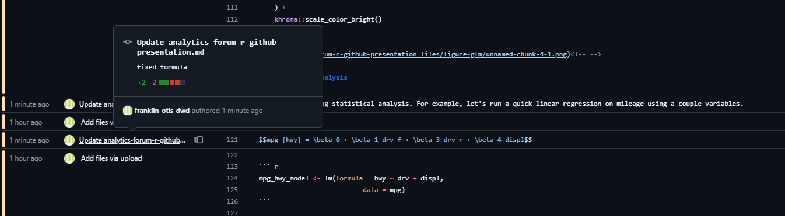
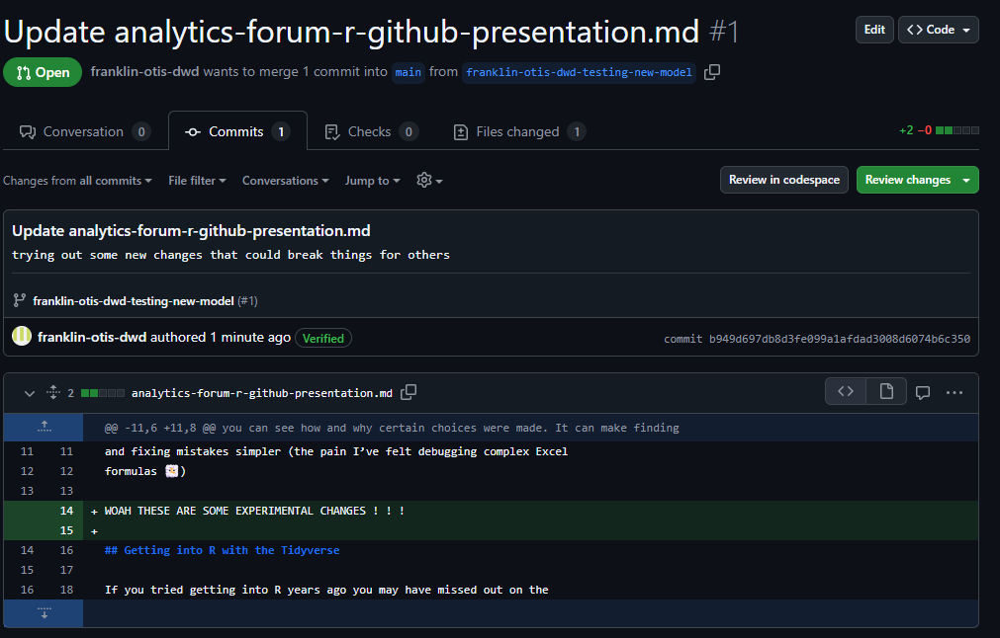

GitHub Basics
================

# Why and How to Use Git/GitHub?

Git itself is a version control system. GitHub is a company (now owned by Micorosft) with a platform and website which use Git as the basis for managing, storing, and distrubiting code. 

Git and GitHub has its own specific terminology. 

- A _repo_ is a repository, think of it like a big project folder. This is change.
- A _commit_ is when you store a revised version of the file. 

## Version Control

Git's primary purpose is version control. Imagine Word’s track changes, but for all files and multi-file projects. 
You can go back and undo specific changes and see who made what changed and when. 

It's an easier way to see what the most up-to-date version of a file. Tired of naming things "project (1)v2 final.txt"? Git is one way to get around that.

This is called the 'blame' feature (admittedly kind of a negative framing), but it can be useful!
<!-- -->

## Concurrent Working

If two people are working on the same document at the same time, these
two can each work on the same thing. Then they can update that file on
GitHub. If there are conflicts, say they both changed the same piece of
the file, then Github can allow you to see what is in conflict and you can
decide piecemeal what to do with that.

You can also create a separate "branch" of the repository. This means you can try some experimental changes without worrying about it affecting anyone else using these files. 
<!-- -->

## Documentation

GitHub also has features to allow you to keep track of issues you'd like to fix or features to add with the Issues tab. This can be good to more openly track these problems and document the history of fixing them. 

You can also create documents like this type of markdown document or [wikis](https://docs.github.com/en/communities/documenting-your-project-with-wikis) as part of a repo to add additional explanation to how to use the project.

## Policies

As it stands now, the GitHub website is the way to interface with GitHub. This means you'll have to manually download and upload to the GitHub site to make any changes. 
GitHub is a cloud service. This means you **must be careful with protected information**. If you're working with code that interacts with protected data, be extremely vigilant not to add any of that data itself to the repo. 

As it stands, you need permission from IT to download Git and a GitHub desktop application to interface more seamlessly with GitHub. 
